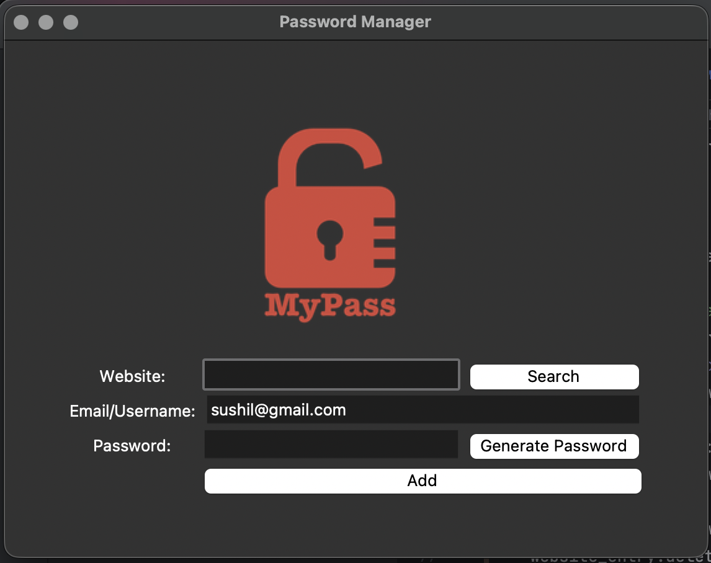

# Password Manager

A simple Python-based password manager for storing and retrieving credentials securely.

## Features
- Add and save passwords
- Search saved credentials by website
- Local JSON-based storage (data.json)
- Simple Tkinter GUI interface
- Error handling for missing data files

## Tech Stack
- Python 3
- Tkinter

## What I Learned
- How to structure a small Python project
- Handling user input and building a GUI flow
- Basic file handling for storing and retrieving data
- Importance of not exposing sensitive data (like passwords)

## Preview
